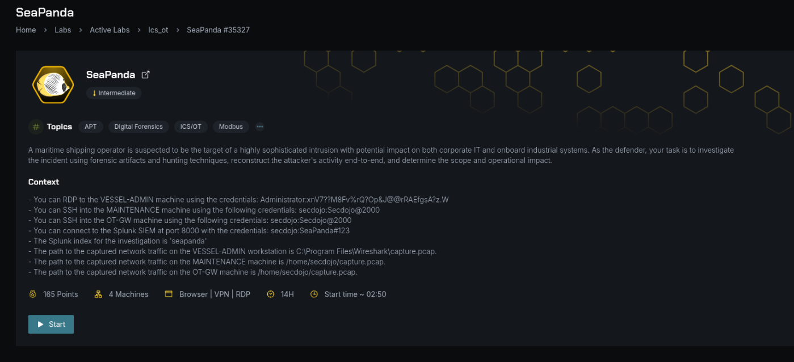
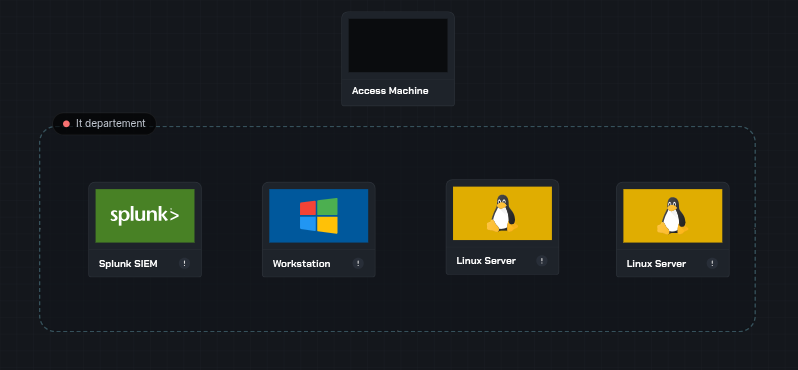
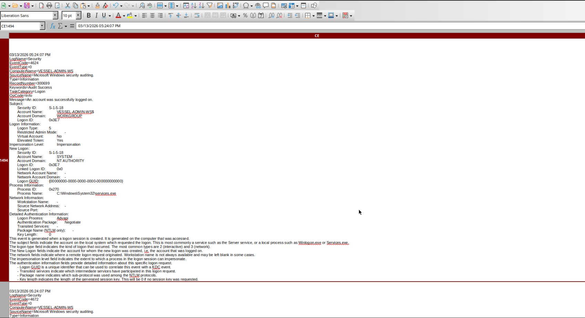
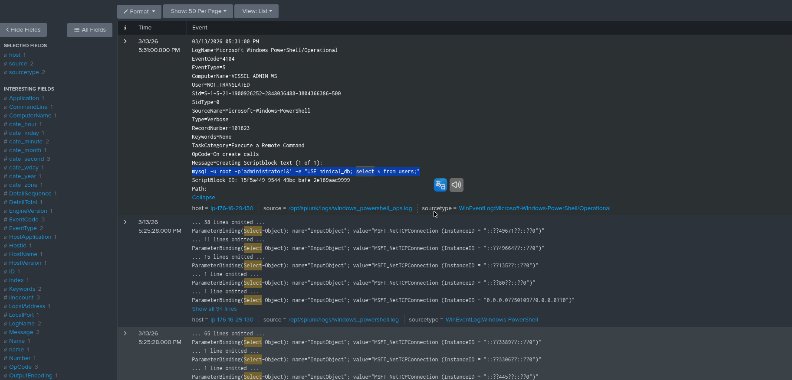
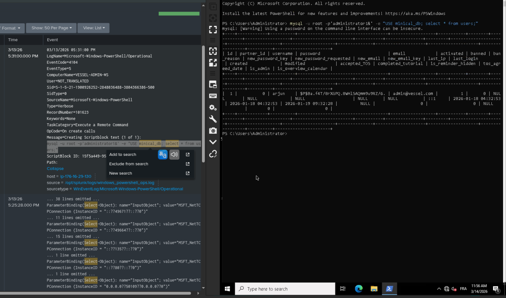
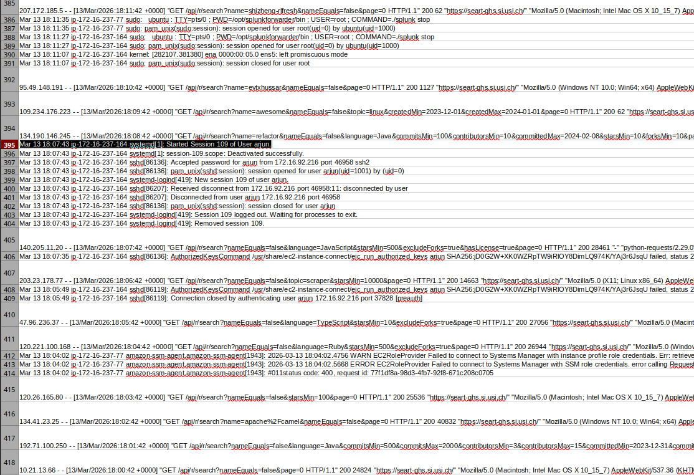
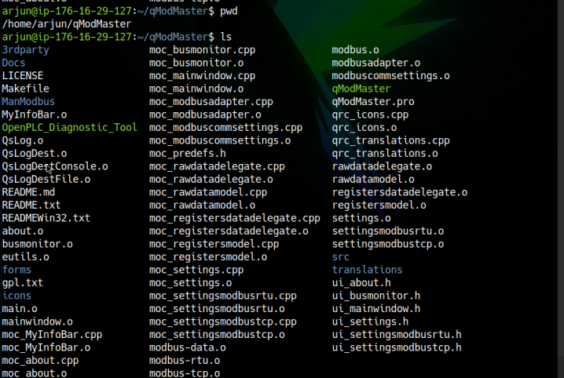
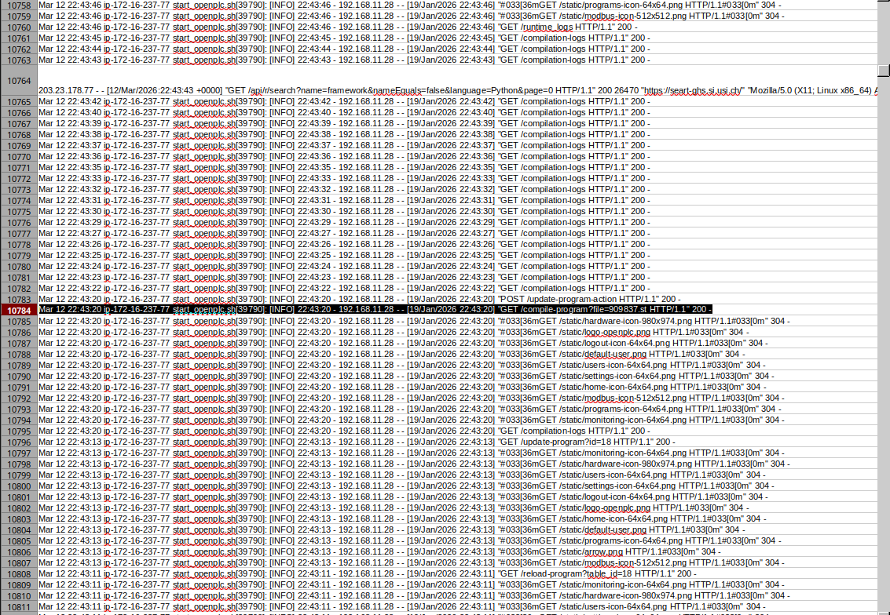

 # Reconstructing the Maritime Industrial Control System Attack

This attack reconstruction was played in **Secodojo** labs during the **DSGN** competition

<br><br>

### Investigating the Operational Technology Cyber Attack: From USB Infection to PLC Manipulation


In this investigation I analyzed a simulated `cyber-physical attack` targeting a **maritime shipping operator**

The attacker successfully compromised access into the vessel's ICS (Industrial Control System) environment controlling OpenPLC

This investigation analyzes a simulated **cyber-physical attack** targeting a **maritime shipping operator** 

The attacker demonstrated a high level of sophistication, carefully chaining multiple techniques to pivot from the `IT environment` into critical `OT infrastructure`

---

### Investigation Environment

 

<br>

In a real-world industrial environment, different machines have different roles, which is why the lab has multiple machines instead of one

To reconstruct the attack chain, the lab provided multiple systems representing both corporate IT and OT networks:

 Machine | OS | Role |
|-|-|-|
| **VESSEL-ADMIN Workstation** | Windows | Administrative workstation used to manage vessel systems |
| **MAINTENANCE Server** | Linux | Maintenance server for managing operational systems |
| **OT-GW (Operational Technology Gateway)** | Linux | Gateway between corporate IT network and industrial control systems |
| **Splunk SIEM Platform** | Platform | Centralized log analysis |

---

<br>

### Targeted Sabotage

The operation was a **multi-stage cyber-physical attack** designed to induce kinetic impact on the vessel's stability systems

**The attacker leveraged `IT/OT` convergence to pivot from Windows-based management systems to Linux-based `ICS`**

They manipulated `Modbus TCP registers` to alter vessel control logic

<br>

### Attack Chain
### 1- Initial Compromise (Weaponization & Delivery) : Windows Foothold (IT Intrusion)

The attack began with the introduction of a `malicious USB` device connected to the administrative workstation `VESSEL-ADMIN-WS` Allowed the attacker **to deliver the initial payload**

A binary named `USBInstaller.exe` was executed directly from the removable drive

The installer dropped a `malicious binary` vessel_update.exe The malware injected its code into a legitimate process to evade detection

<br>

<br>

```bash
03/13/2026 05:07:02 PM
LogName=Microsoft-Windows-Sysmon/Operational
EventCode=11
EventType=4
ComputerName=VESSEL-ADMIN-WS
User=VESSEL-ADMIN-WS\Administrator
Sid=S-1-5-21-1900926252-2848036488-3804366386-500
SidType=1
SourceName=Microsoft-Windows-Sysmon
Type=Information
RecordNumber=22011
Keywords=None
TaskCategory=FileCreate
OpCode=Info
Message=File created:
RuleName: -
UtcTime: 2026-01-20 17:07:02.401
ProcessGuid: {6b7f4a2c-3d3a-65ad-0000-00102a3f0000}
ProcessId: 4128
Image: E:\USBInstaller.exe
TargetFilename: C:\Users\Administrator\AppData\Local\Temp\vessel_update.exe
CreationUtcTime: 2026-01-20 17:07:02.401
User: VESSEL-ADMIN-WS\Administrator
Hashes: SHA256=7F0C2A3B5E0E7D2E2A7B7A0E0D7DAB3A7B8E5D4C2B1A0F9E8D7C6B5A4E3D2C1B
AdditionalInfo: SourceDrive=E:\ (DriveType=Removable; Device=USBSTOR)
```

#### Infection Vector: `Physical USB drive`
- **File executed :**  `E:\USBInstaller.exe`
- **Dropped malicious binary :** `C:\Users\Administrator\AppData\Local\Temp\vessel_update.exe`
- **Malware Technique**: DLL Sideloading (injected DLL into legitimate process to hide activity)
- **Anti-Forensics**: Self-deletion routine after injection

**Malware Functionality (Fake Update):**

- Claimed to be a software update
- In reality: stealth execution, credential theft, persistence, and preparation for OT attack

### 2- Credential Harvesting & Database Access

After establishing a foothold, the attacker began searching for **credentials** stored locally on the system.

During this phase **the attacker accessed a database** associated with the web application running on the system

**Recovered Credentials :** `arjun/SeaPanda123`

These credentials were later used for **lateral movement**




<br>

- **Malware scanned local files for credentials**
- Extracted **Linux administrative credentials**: `arjun:SeaPanda123!`
- **Splunk logs** revealed unusual file access followed by outbound connections to `C2`

With the stolen credentials, the attacker authenticated to other systems within the internal network

This phase demonstrates Credential Reuse for **Lateral Movement**

### 3- SSH Lateral Movement

Using the credentials of user arjun, **the attacker initiated an SSH session from the Windows workstation to a Linux-based `OT gateway`**

<br>

- **Used stolen credentials to SSH from Windows to Linux OT management server (172.16.237.77)**

- **Modified /etc/ssh/sshd_config for persistence**

### 4 — PLC Targeting and OT Manipulation

Once inside the OT Gateway, the attacker performed reconnaissance to identify industrial services running on the system.

Reconnaissance commands:

- system identification : **whoami & uname -a**

- check open OT ports and to o find the Modbus Port (502) and Web Port (8080) : **ss -tanup**
 
- TCP scan, living of the land port discover : **for p in {1..65535}; do echo >/dev/tcp/...**

<br>

The attacker uploaded a malicious diagnostic tool into a legitimate directory : `OpenPLC_Diagnostic_Tool` 



<br>


<br>

```bash
Mar 12 22:43:20 ip-172-16-237-77 start_openplc.sh[39790]: [INFO] 22:43:20 - 192.168.11.28 - - [19/Jan/2026 22:43:20]"GET /compile-program?file=909837.st HTTP/1.1" 200 -
```

<br>

`Target` : **OpenPLC Runtime (vessel control), deploying OpenPLC_Diagnostic_Tool in the qModMaster directory**

`Tool deployed` : **OpenPLC_Diagnostic_Tool**

`Protocol` : **Modbus TCP port : 502**

`Malicious Payload` : **909837.st uploaded via OpenPLC Web Interface (/compile-program?file=909837.st)**

`Vulnerability` : **The PLC allowed Unauthorized Write Access to registers**

<br>

At this stage of the attack chain, the threat actor had successfully pivoted into the OT environment and gained the ability to manipulate the PLC controlling the vessel’s critical operations

This level of access allowed the attacker to potentially influence the vessel’s ballast control system, which directly affects the ship’s stability<br>

**Attack timeline :**

```bash
    2026-03-13 08:00 : USB drive inserted; E:\USBInstaller.exe executed on VESSEL-ADMIN-WS
    2026-03-13 08:30 : Malicious `vessel_update.exe` runs (process hollowing, MD5=6103328e...) 
    2026-03-13 09:00 : Scheduled task “VesselMaintenance” created; payload contacts C2 (Sliver)
    2026-03-13 09:15 : Attacker runs PowerShell port scan (TCPClient loop)【23†L175-L182】 
    2026-03-13 09:30 : MySQL creds dumped (`arjun:SeaPanda123!` found)
    2026-03-13 09:45 : SSH login to 172.16.237.77 using arjun (SSH lateral movement)
    2026-03-13 10:00 : On Linux: attacker runs OpenPLC_Diagnostic_Tool (MD5=6103... Go binary)
    2026-03-13 10:10 : `1..254 | Test-Connection` ping sweep on 172.16.237.x【26†L39-L44】 
    2026-03-13 10:30 : Attacker uploads `909837.st` via OpenPLC web interface【32†L298-L304】
    2026-03-13 10:35 : Modbus/TCP writes to PLC on port 502 (ballast control logic overwritten)【34†L713-L720】
```

<br>

## Attack Chain :

USB Device<br>
Windows Workstation (VESSEL-ADMIN-WS)<br>
Malware Execution (vessel_update.exe)<br>
Credential Extraction<br>
Use of Stolen Credentials<br>
SSH Lateral Movement<br>
Compromise of OT Gateway<br>
Modbus Exploitation<br>
Malicious PLC Logic Deployment (909837.st)<br>

<br><br>

## MITRE ATT&CK Mapping :

The attacker techniques observed during the investigation map to several MITRE ATT&CK tactics :

| Tactic            | Technique                             | ID            |
| ----------------- | ------------------------------------- | ------------- |
| Initial Access    | Removable Media                       | T1091         |
| Execution         | Command and Scripting Interpreter     | T1059         |
| Defense Evasion   | Process Injection (Process Hollowing) | T1055.012     |
| Persistence       | Scheduled Task                        | T1053         |
| Credential Access | Credentials from Files                | T1552         |
| Discovery         | Network Service Scanning              | T1046         |
| Lateral Movement  | SSH                                   | T1021.004     |
| Command & Control | Sliver C2                             | T1071         |
| Impact            | Manipulation of Control Logic         | ICS Technique |


<br>

**The investigation reconstructed a full IT-to-OT intrusion. The attacker gained initial access via a malicious USB device, executed malware on the Windows workstation, extracted credentials, and used them for SSH lateral movement to the OT gateway. From there, the threat actor interacted with the OpenPLC system and deployed malicious PLC logic over Modbus TCP (port 502), gaining the ability to manipulate vessel control operations**